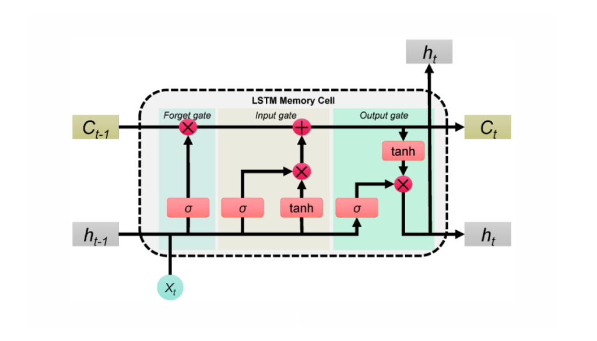
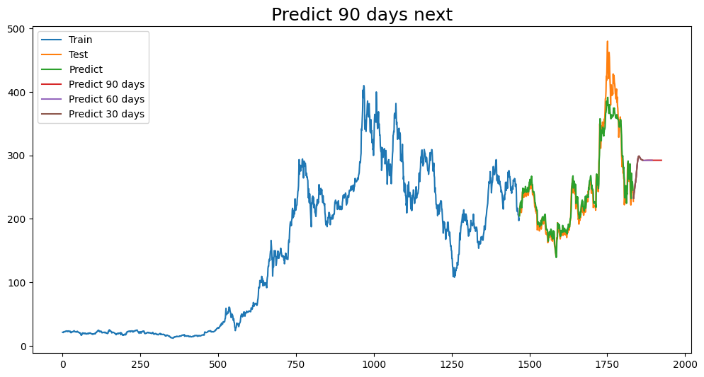
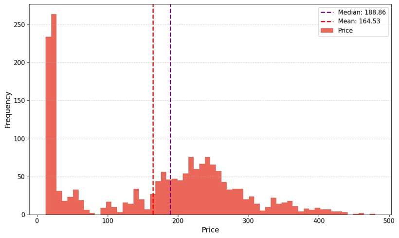
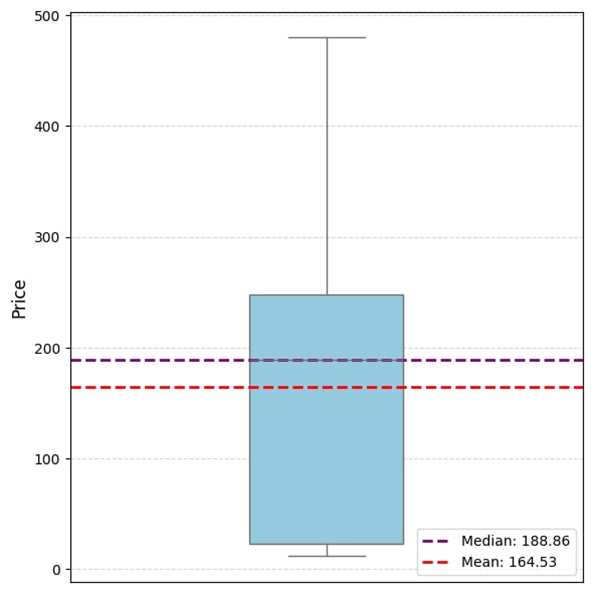

# Time Series Prediction Project

## Overview
This project implements and compares various deep learning and machine learning models for time series prediction, including LSTM, ResNet, and SVR approaches.

## Methodology
The project employs several state-of-the-art models for time series forecasting:

- LSTM (Long Short-Term Memory) networks
- ResNet (Residual Neural Network)
- SVR (Support Vector Regression)
- ARIMA (Autoregressive Integrated Moving Average)

## Results
The models were evaluated using various performance metrics and visualization techniques:

*LSTM Architecture*

*Prediction Results Comparison*

## Data Analysis
The project includes comprehensive data analysis:

*Data Distribution Analysis*

*Statistical Analysis*

## Technical Details
- Implemented in Python
- Utilizes deep learning frameworks for model development
- Includes comprehensive data preprocessing and analysis
- Features detailed model evaluation and comparison

## Project Structure
- `Paper/`: Contains research paper and related materials
- `Paper/LatexFile/`: Includes LaTeX source files and visualizations
- Source code and implementation details are organized in respective directories

## License
This project is licensed under the MIT License - see the LICENSE file for details. 